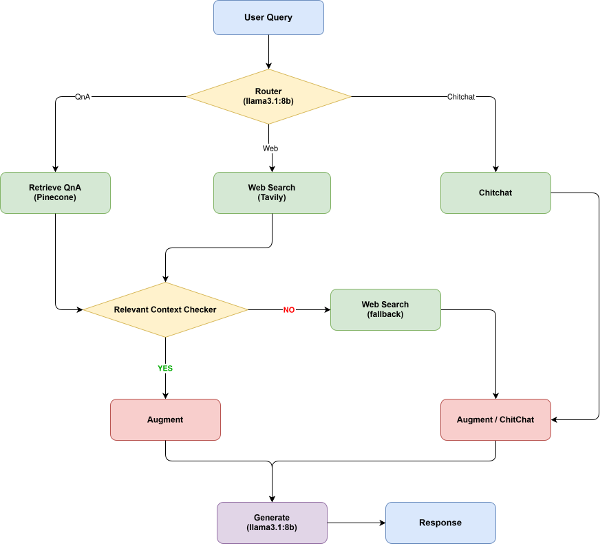
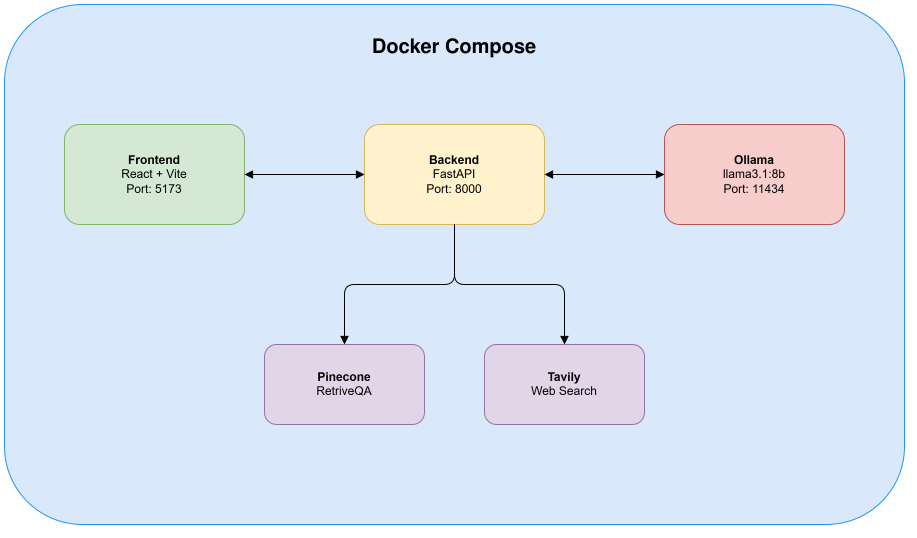

# Bank RAG Assistant

<p align="center">
  <br>
  <strong>Agentic RAG Pipeline — Bank Customer Support</strong>
</p>

<p align="center">
  <!-- GitHub Stats -->
  
  
  
</p>
<p align="center">
  
  
  
  
  
</p>

---

## Abstract

**Bank Retrieval-Augmented Generation (Agentic RAG) Assistant** is a customer service chatbot powered by **Agentic RAG**. It understands user queries, retrieves information from diverse knowledge sources — internal databases, FAQs, external documents — and provides accurate, context-aware responses for smarter support.

The system employs an intelligent routing mechanism that dynamically selects the most appropriate retrieval strategy:
- **QnA Retrieval** via Pinecone Vector Store for internal knowledge
- **Web Search** via Tavily for up-to-date external information
- **Chitchat** handling for general conversation

With a self-corrective loop, the agent evaluates context relevance and automatically falls back to alternative sources when needed, ensuring high-quality responses at every turn.

---

## Table of Contents

1. 📜 [Abstract](#abstract)
2. 🏗️ [Architecture](#architecture)
3. ✨ [Features](#features)
4. 🛠️ [Tech Stack](#tech-stack)
5. ⚙️ [System Requirements](#system-requirements)
6. 🚀 [Quick Start](#quick-start)
7. 🔌 [API Reference](#api-reference)
8. 🧠 [Embedding Model](#embedding-model)
9. 📄 [License](#license)

---

## Architecture

### Agentic RAG Pipeline

The diagram above illustrates the end-to-end workflow of the Agentic RAG system. A user query is first processed by a routing model (gpt-4o-mini), which determines the most appropriate handling strategy, including:

- **Retrieve QnA**, where relevant information is fetched from a vector database (Pinecone)
- **Web Search**, which queries external sources via Tavily for up-to-date information
- **Chitchat**, used for general conversational interactions

After retrieval, the information is evaluated by a relevance checker to ensure it aligns with the user’s intent. If the context is useful, it is used to augment the query; otherwise, the system dynamically falls back to alternative strategies such as web search or chitchat.

Finally, the processed input is passed to the generation model (gpt-4o-mini), which produces a context-aware and accurate response. This agentic design enables adaptive decision-making and improves reliability compared to traditional RAG pipelines.

<div align="center">
    
    <p><em><b>Figure 1: Agentic RAG Pipeline</b></em></p>
</div>

### System Architecture

The system is deployed using a Docker Compose-based microservices architecture, where each component operates independently but communicates seamlessly within a unified network. The main components include:

- **Frontend (React + Vite)** running on port 5173, providing a responsive chat interface
- **Backend (FastAPI)** running on port 8000, responsible for orchestration and API handling
- **LLM Service (OPENAI API - GPT-4O-MINI)** using api from openai platform

In addition, the system integrates external services such as Pinecone for semantic vector retrieval and Tavily for real-time web search.

All components are connected within the Docker network, ensuring scalability, modularity, and ease of deployment.

<div align="center">
    
    <p><em><b>Figure 2: System Architecture</b></em></p>
</div>

---

## Features

- 🤖 **Agentic RAG** — self-corrective retrieval loop with automatic fallback
- 🔀 **Intelligent Router** — automatically classifies query intent
- 🧠 **Vietnamese Embedding** — optimized for Vietnamese language understanding
- 📚 **Multi-source Retrieval** — Pinecone Vector Store + Tavily Web Search
- 💬 **Session Management** — per-user chat history isolation
- 🏃 **Local LLM** — gpt-4o-mini via openai api
- ⚡ **GPU Accelerated** — NVIDIA CUDA support via Docker
- 🐳 **Dockerized** — one-command deployment

---

## Tech Stack

The table below provides a comprehensive comparative analysis of the three architectural frameworks: Traditional RAG, Agentic RAG, and Agentic Document Workflows (ADW). This analysis highlights their respective strengths, weaknesses, and best-fit scenarios, offering valuable insights into their applicability across diverse use cases.

|            | Technology                       |Purpose                      |
|------------|----------------------------------|-----------------------------|
| Frontend   | React + Vite + TailwindCSS       | User interface              |
| Backend    | FastAPI + LangGraph              | API + Agentic pipeline      |
| LLM        | gpt-4o-mini                      |Language generation & routing|
| Embedding  | AITeamVN/Vietnamese_Embedding_v2 | Vietnamese text embedding   |
| Vector DB  | Pinecone                         | QnA knowledge retrieval     |
| Web Search | Tavily                           | Real-time web information   |
| Container  | Docker                           | Deployment & orchestration  |

---

## System Requirements

| Component  | Minimum         | Recommended      |
|------------|-----------------|------------------|
| RAM        | 16GB            | 32GB             |
| GPU        | NVIDIA 6GB VRAM | NVIDIA 8GB+ VRAM |
| CUDA       | 12.x+           | 12.x+            |
| Storage    | 20GB            | 50GB             |
| Docker     | 24.x+           | Latest           |
| Node.js    | 18.x+           | 20.x+            |
| Python     | 3.10+           | 3.10+            |

---

---

---

## Evaluation Metrics

### Generation Metrics

Evaluating the quality of responses generated by llama3.1:8b.

| Metric        | Description                                                 |
|---------------|-------------------------------------------------------------|
| **BLEU**      | Measures n-gram overlap between generated answer and reference |
| **ROUGE-L**   | Measures longest common subsequence (LCS) between texts     |
| **BERTScore** | Measures semantic similarity using BERT contextual embeddings  |

**Results on Bank FAQ dataset:**

| Metric         | Score |
|----------------|-------|
| BLEU           | 0.66  |
| ROUGE-1        | 0.83  |
| ROUGE-2        | 0.77  |
| ROUGE-L        | 0.79  |
| BERTScore (F1) | 0.91  |

---

**Evaluation dataset format:**
```json
[
  {
    "query": "How do I reset my PIN?",
    "reference": "You can reset your PIN at any ATM or via the Techcombank app..."
  }
]
```

## Quick Start

### 1. Clone the repository

```bash
git clone https://github.com/cngchis/bot-sc-agentic-rag.git
cd bot-sc-agentic-rag
```

### 2. Configure environment variables

```bash
# backend/.env
OPENAI_API_KEY=your_api_key
PINECONE_API_KEY=your_pinecone_api_key
INDEX-PINECONE=bank-rag
PINECONE_REGION=us-east-1
TAVILY_API_KEY=your_tavily_api_key
PDF_DIR=./data/pdf
CSV_PATH=./data/csv/bank_fa.csv
JSON_DIR=./data/json/eval.json

# frontend/.env
VITE_API_URL=http://localhost:8000
```

### 3. Build and run with Docker

```bash
# Build all services
docker-compose build

# Start all services
docker-compose up -d

```

### 4. Ingest knowledge base

```bash
# Load PDF documents and CSV FAQs into Pinecone
docker exec -it bank_rag_backend bash
python -m src.vectorstore.pinecone_store
```

### 5. Access the application

| Service               | URL                        |
|-----------------------|----------------------------|
| 🌐 Frontend           | http://localhost:5173      |
| ⚡ Backend API        | http://localhost:8000      |
| 📖 API Docs (Swagger) | http://localhost:8000/docs |

---

## Running Locally (without Docker)

### Backend

```bash
cd backend
python3.12 -m venv [name_env]
source [name_env]/bin/activate
pip install -r requirements.txt

# Run FastAPI
cd backend
uvicorn app.main:app --port 8000
```

### Frontend

```bash
cd frontend
npm install
npm run dev
```

---

## API Reference

### `POST /api/v1/chat`

Send a user query and receive an AI-generated response.

**Request**
```json
{
    "query": "Quên PIN thẻ thì làm sao?",
    "session_id": "user_123",
    "stream": false
}
```

**Response**
```json
{
    "answer": "Bạn có thể đổi PIN tại ATM hoặc ứng dụng techcombank...",
    "source": "Retrieve_QnA",
    "session_id": "user_123"
}
```

**Source values:**
- `Retrieve_QnA` — answered from internal knowledge base
- `Web Search` — answered from real-time web search
- `Chitchat` — general conversation response

---

### `DELETE /api/v1/chat/{session_id}`

Reset the chat history for a specific session.

```bash
curl -X DELETE http://localhost:8000/api/v1/chat/user_123
```

---

### `GET /api/v1/health`

Health check endpoint.

```json
{
    "status": "ok",
    "service": "Bank RAG Assistant"
}
```

---

## Embedding Model

The system uses **AITeamVN/Vietnamese_Embedding_v2** — a state-of-the-art embedding model optimized for Vietnamese language:

```python
from sentence_transformers import SentenceTransformer
from langchain.embeddings.base import Embeddings

_model = SentenceTransformer("AITeamVN/Vietnamese_Embedding_v2")

class CustomEmbedding(Embeddings):
    def embed_documents(self, texts: list[str]) -> list[list[float]]:
        return _model.encode(texts, show_progress_bar=True).tolist()

    def embed_query(self, text: str) -> list[float]:
        return _model.encode([text])[0].tolist()
```

| Property     | Value                            |
|--------------|----------------------------------|
| Model        | AITeamVN/Vietnamese_Embedding_v2 |
| Dimension    | 768                              |
| Language     | Vietnamese (optimized)           |
| Vector Store | Pinecone (cosine similarity)     |

---

## Docker Commands

```bash
# View running containers
docker-compose ps

# View real-time logs
docker-compose logs -f backend

# Restart a service
docker-compose restart backend

# Enter a container for debugging
docker exec -it bank_rag_backend bash

# Stop all services
docker-compose down

# Stop and remove volumes
docker-compose down -v
```

---

## License

MIT License — feel free to use, modify, and distribute.